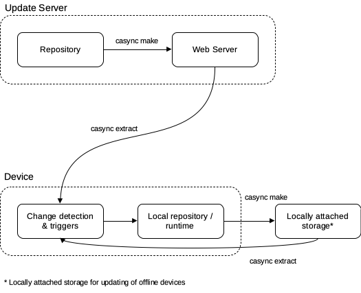

# casync-updater
casync based OTA updater for software running on linux

## Introduction
A simple self updating software update system with offline updating capabilities through locally attached storage (e.g. a USB drive). More information on casync can be found on by running ```man casync```.



## Dependencies
* casync
* diffutils
* nodejs

## Installation
```shell
sudo apt-get update
sudo apt-get upgrade
wget -q https://github.com/bcc-code/casync-updater/raw/master/deploy/install.sh -O - | sudo bash
```
*Installation script only tested successfully on Raspberry Pi OS Buster & Ubuntu 20.04. It is not working on Ubuntu 18.04.*

The casync-updater client is installed as a systemd service.
Please run ```systemctl status casync-updater.service``` to ensure the service is running correctly.

Client configuration files directory: /etc/casync-updater

Node JS scripts directory: /opt/casync-updater

Restart the casync-updater service after modifying configuration files for the changes to take effect.

## Server
The server.js Node.js script should executed passing the configuration file as an argument:
```console
node /opt/casync-updater/server.js your/directory/server.json
```
This can be included as part of your CI/CD pipeline.

Configuration file example:
```json
{
    "index": "/var/www/html/index.caidx",
    "store": "/var/www/html/store.castr",
    "source": "/your/directory/source"
}
```
Configuration can also be passed as an array:
```json
[
    {
        "index": "/var/www/html/index.caidx",
        "store": "/var/www/html/store.castr",
        "source": "/your/directory/source"
    },
    {
        "index": "/var/www/html/index2.caidx",
        "store": "/var/www/html/store2.castr",
        "source": "/your/directory/source2"
    }
]
```

where:
* "index" is the path to the casync index file (typically stored in a web root directory).
* "store" is the path to the casync store directory (typically stored in a web root directory).
* "source" is the path to the directory or device where the repository to be distributed is stored.

## Client
The casync-updater client reads a configuration file / directory with configuration files on startup. When installed using the installation script as described above, it will read all JSON formatted text configuration files in the /etc/casync-updater directory.
A configuration file may contain one or several configuration entries.

The installation script includes a default configuration script used to automatically update the casync-updater installation. This default configuration file may be modified to suit your needs (e.g. to point the updater to your own source location etc.)

Configuration file example:
```json
[
    {
        "interval": 3600000,
        "srcIndex": "https://project1.example/updates/fancyName.caidx",
        "srcStore": "https://project1.example/updates/fancyName.castr",
        "dstPath": "/usr/bin/project1"
    },
    {
        "interval": 1800000,
        "srcIndex": "https://myproject.example/updates/fancyName.caidx",
        "srcStore": "https://myproject.example/updates/fancyName.castr",
        "backupIndex": "/media/backupDrive/myproject-updater/otherFancyName.caidx",
        "backupStore": "/media/backupDrive/myproject-updater/otherFancyName.castr",
        "dstPath": "/usr/bin/myproject",
        "triggers": [
            {
                "paths": [
                    "path/to/file1",
                    ".",
                    "path/to/dir2"
                ],
                "actions": [
                    "sh /action/script/location.sh",
                    "systemctl restart your.service"
                ]
            },
            {
                "paths": [
                    "another/path"
                ],
                "actions": [
                    "node yourscript.js"
                ]
            }
        ],
        "startup": [
            "first/command",
            "second/command"
        ]
    }
]
```
where:
* "interval" is the update interval in milliseconds
* "srcIndex" is the location of the (online) source casync (caidx) index file
* "srcStore" is the location if the (online) source casync (castr) store directory
* "backupIndex" (optional) is the path to the local backup casync index file (typically a location on external storage used for transferring updates to offline devices).
* "backupStore" (required only when backupIndex is set) is the path to the local backup casync store directory.
* "dstPath" is the local directory path to be updated
* "triggers" is a list of paths and associated actions. When one of the specified "paths" (relative directory or file path) is updated, the list of "actions" is executed (shell commands).
* "startup" is a list of commands that are executed on service startup. The startup commands are executed after the initial casync extract is complete and corresponding triggers are executed.

## To do
- [ ] Save the server checksum to file to reduce bandwidth for client update checks (i.e. do not download the full index file to get the latest server checksum).
- [ ] Secure backup store - prevent unintentional / malicious tampering with offline updates. (Ideas welcome)
- [ ] Distribute casync-updater updates via CDN (and not directly from GitHub pages due to usage limits).
